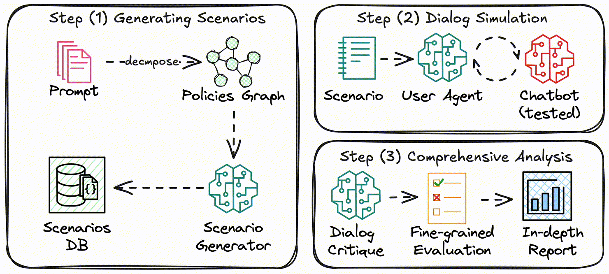

# sqwish-testbench

## How it works


## Run the Simulator
### Simulate conversations
```bash
python run.py --output_path results/customer_support --config_path ./config/config_customer_support.yml 
```

### Visualize the results
```bash 
streamlit run simulator/visualization/Simulator_Visualizer.py
```