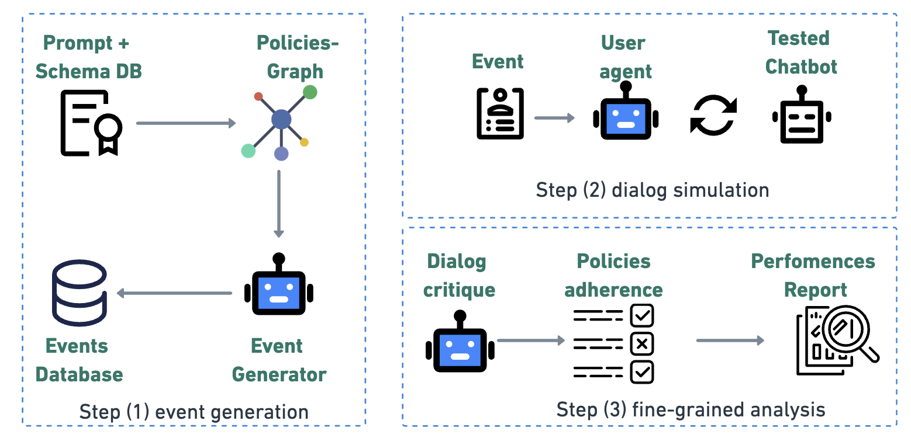
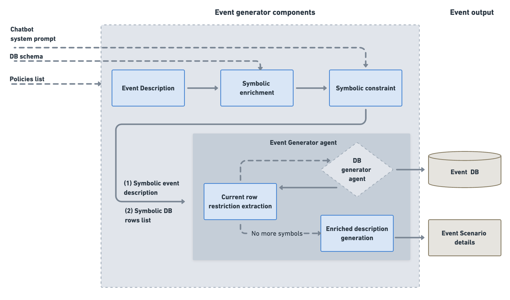
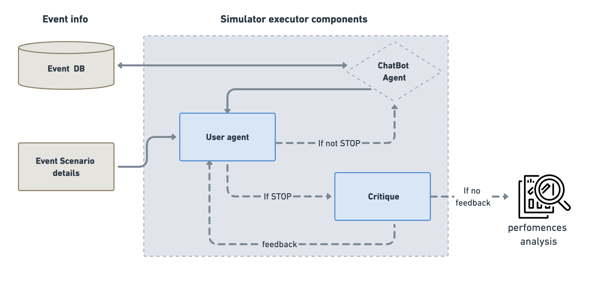

# Architecture System Overview 

The IntellAgent system pipeline consists of three main components:

1. **Event Generation**
   - Input: Database schema and either:
     - Chatbot system prompt, or
     - Company policy documentation
   - Output:
     - Policy graph representation
     - Generated events with varying complexity levels, including:
       - Scenario descriptions
       - User requests
       - Initial database states
    
2. **Dialog Simulation**
   - Input: Generated events and configured agents
   - Output: 
     - Complete conversation transcripts
     - Tool usage logs
     - Agent reasoning traces

3. **Fine-Grained Analysis**
   - Input: Dialog transcripts and policy requirements
   - Output:
     - Detailed performance metrics
     - Policy compliance analysis
     - Complexity-based evaluation reports

## 1. Event Generation
The IntellAgent Event Generator creates realistic chatbot interactions through a multi-stage pipeline that transforms high-level policies into concrete scenarios with corresponding database states. The process consists of three main components:

### 1.1 Policy Analysis & Graph Construction
The `DescriptionGenerator` class handles the initial policy analysis through these steps:

1. **Flow Extraction**: Breaks down the system prompt into distinct flows
2. **Policy Extraction**: Analyzes each flow to identify individual policies and assigns complexity scores
3. **Graph Construction**: Creates a weighted graph where:
   - Nodes: Individual policies with complexity scores
   - Edges: Weighted connections (1-10) indicating the likelihood of two policies appearing together in the same task
   - Edge weights are determined through LLM evaluation of policy pairs

### 1.2 Event Generation Pipeline

#### 1.2.1 Description Generation
The system generates event descriptions through:
1. Sampling policies based on target complexity:
   - Starts with a random policy node
   - Performs weighted random walks based on edge weights
   - Continues until reaching desired complexity threshold
2. Converting selected policies into natural language scenarios
3. Generating expected chatbot behaviors
4. (Optional) Refining expected behaviors through feedback iterations

#### 1.2.2 Symbolic Representation
The `EventsGenerator` class transforms descriptions into concrete events by:
1. Creating symbolic representations of entities and relationships
2. Defining database constraints based on policies
3. Converting symbolic representations into actual database states through:
   - Table-specific insertion tools
   - Validation of referential integrity
   - Parallel processing of multiple events

## Dialog Simulation Architecture

The Dialog Simulation system orchestrates conversations between simulated users and chatbots. The system consists of two main components: the Dialog Graph and Dialog Manager.

### Dialog Graph 

The Dialog Graph implements a state machine that manages the conversation flow between the simulated user and chatbot. Key features include:

- **State Management**: Uses `DialogState` to track:
  - User and chatbot message history
  - User thoughts and reasoning
  - Critique feedback
  - Stop signals for conversation termination

- **Node Types**:
  - User Node: Simulates user responses and tracks reasoning
  - Chatbot Node: Handles chatbot responses and tool interactions
  - Critique Node: Evaluates conversation adherence to policies

- **Flow Control**:
  - Manages message passing between participants
  - Handles conversation termination conditions
  - Supports conversation feedback loops through critique evaluation

### Dialog Manager

The Dialog Manager controls the execution of dialogs and provides the infrastructure for running simulations. Key features include:

- **Configuration Management**:
  - Configures LLM models for user, chatbot, and critique agents
  - Sets up environment tools and schemas
  - Manages prompt templates and parsing functions

- **Execution Modes**:
  - Synchronous execution (`run`)
  - Asynchronous execution (`arun`)
  - Batch processing of multiple events (`run_events`)

- **Memory Management**:
  - SQLite-based conversation storage
  - Tracks tool calls and their outputs
  - Maintains conversation history

### Simulation Flow

1. The Dialog Manager initializes the environment and agents
2. For each event:
   - User agent receives event details and expected behaviors
   - Conversation alternates between user and chatbot
   - Critique agent evaluates responses against policies
   - Conversation continues until success or policy violation

### Key Features

- **Policy Enforcement**: Built-in critique system to evaluate chatbot adherence to defined policies
- **Parallel Processing**: Support for parallel execution of multiple conversations
- **Extensible Architecture**: Modular design allowing for custom LLMs, tools, and evaluation criteria
- **Comprehensive Logging**: Detailed tracking of conversations, tool usage, and agent reasoning

### 3. Fine-Grained Analysis
The Dialog critique component performs a detailed evaluation of the conversation by analyzing:

1. The user-chatbot dialog history
2. The chatbot's system prompt
3. The termination reason provided by the user agent

The critique process follows these steps:

1. **Termination Validation**: Verifies if the stated reason for dialog termination is accurate
   - If incorrect: Provides feedback through `critique_feedback` and continues the dialog
   - If correct: Proceeds with policy analysis

2. **Multi-Level Policy Coverage Analysis**: 
   - Identifies which event policies were tested during the conversation
   - Determines which policies were violated (if any)
   - Evaluates policies across different complexity levels, ranging from straightforward tasks to highly complex and nuanced edge-case scenarios  
3. **Report Generation**: Creates a detailed performance assessment based on the above analysis, with insights categorized by policies and complexity level

