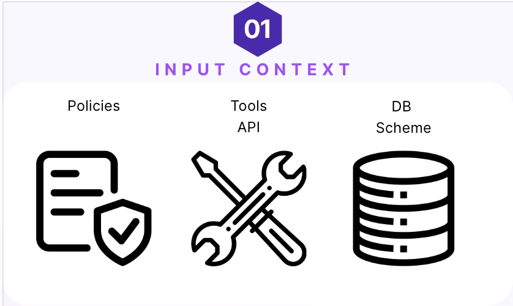
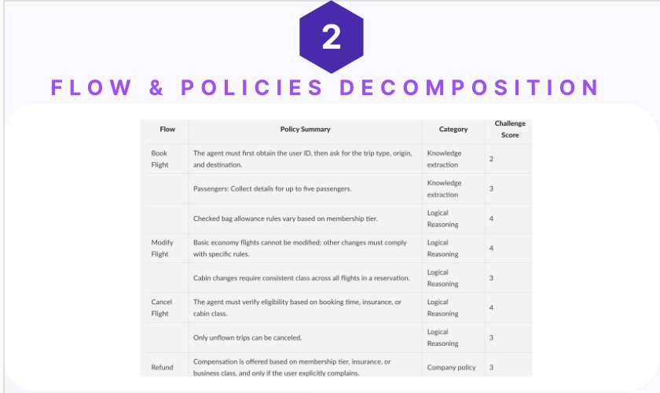
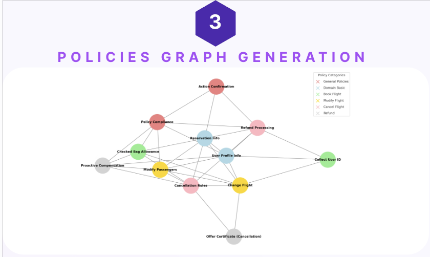
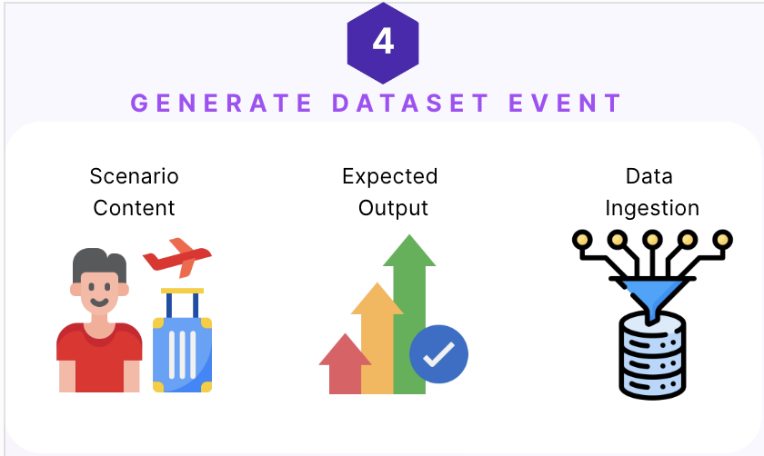
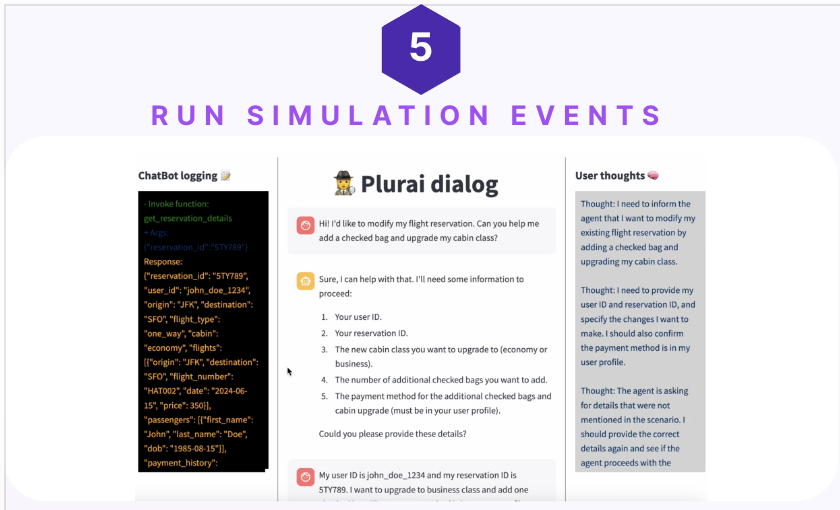
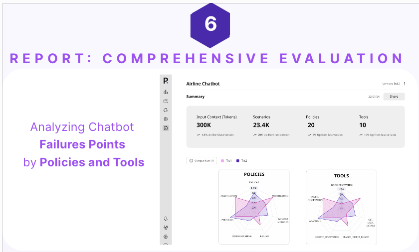

# How IntellAgent works

IntellAgent operates through a sophisticated AI pipeline powered by Large Language Models (LLMs) and Langraph agents. This document outlines the step-by-step optimization process flows.

## Pipeline Overview

### 1. Input Context Analysis
The process begins with a comprehensive analysis of your agent's context, including:
- Task descriptions
- Available tools
- Database schema

This initial analysis establishes the foundation for understanding the agent's intended behavior and operational boundaries.

### 2. Flow and Policies Generation
The system automatically:
- Decomposes the agent's primary task into sub-flows
- Extracts relevant policies and guidelines
- Identifies potential edge cases and interaction patterns

### 3. Policies Graph Generation
IntellAgent creates a weighted graph structure where:
- Nodes represent individual policies
- Edges indicate relationships between policies
- Edge weights reflect the challenge score of implementing connected policies together

This graph helps identify complex interaction scenarios requiring testing.

### 4. Dataset Event Generation
The system generates comprehensive test scenarios including:
- **Scenario Content**: Specific user interaction cases
- **Expected Output**: Desired agent behavior based on policies
- **Data Ingestion**: Required database records and state prerequisites

Each scenario is assigned varying challenge scores to ensure thorough testing across complexity levels.

### 5. Simulation Execution
IntellAgent runs generated scenarios through an interactive dialog system, capturing:
- Event execution details
- Complete dialog logs
- Simulated user interactions
- Agent thought processes
- Performance metrics

### 6. Comprehensive Evaluation
The final output includes detailed analysis across multiple dimensions:
- Complexity level performance breakdown
- Policy interaction success/failure patterns
- Tool usage effectiveness
- Specific failure point identification

## Key Components

The framework is designed with modularity and adaptability in mind, allowing for:
- Easy extension to support new input contexts
- Integration with different chat agents
- Customizable evaluation metrics
- Scalable testing scenarios

This architecture ensures that IntellAgent can evolve to meet changing testing needs while maintaining comprehensive coverage of potential edge cases and failure points.